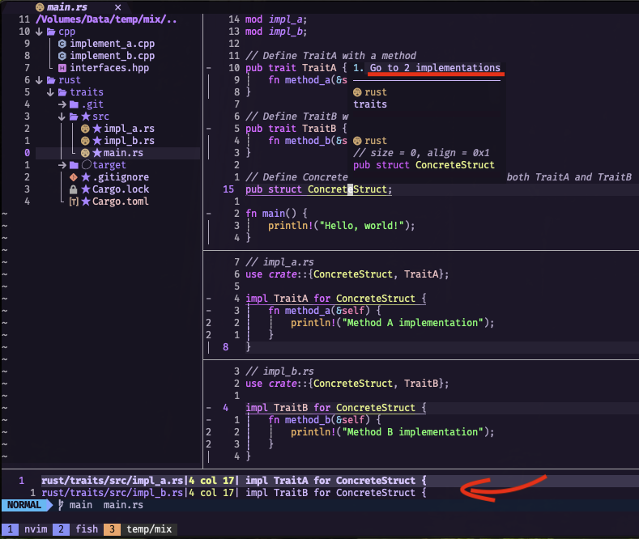
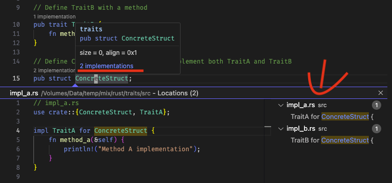

# Rust Tips: How to Check Traits Implemented for a Struct or Enum


When transitioning from OOP languages to Rust, you might notice some differences in how traits (similar to interface in Java) are handled. In OOP, a class often centralizes information about inherited interfaces, making it easy to see at a glance.

## Java Example

```java
// Interfaces.java
interface InterfaceA {
    void methodA();
}

interface InterfaceB {
    void methodB();
}
```

```java
// ConcreteClass.java
public class ConcreteClass implements InterfaceA, InterfaceB {
    @Override
    public void methodA() {
        // Implementation for methodA
    }

    @Override
    public void methodB() {
        // Implementation for methodB
    }
}
```

In Rust, however, traits implemented by a struct or enum might not be as immediately obvious, since their implementations can be scattered across multiple files.

## Rust Example

```rust
// interfaces.rs
pub trait InterfaceA {
    fn method_a(&self);
}

pub trait InterfaceB {
    fn method_b(&self);
}
```

```rust
// concrete_struct.rs
pub struct ConcreteStruct;

impl ConcreteStruct {
    pub fn new() -> Self {
        ConcreteStruct
    }
}
```

```rust
// impl_a.rs
use crate::interfaces::InterfaceA;
use crate::concrete_struct::ConcreteStruct;

impl InterfaceA for ConcreteStruct {
    fn method_a(&self) {
        // Implementation for method_a
    }
}
```

```rust
// impl_b.rs
use crate::interfaces::InterfaceB;
use crate::concrete_struct::ConcreteStruct;

impl InterfaceB for ConcreteStruct {
    fn method_b(&self) {
        // Implementation for method_b
    }
}
```

Thankfully, rust-analyzer, a powerful tool for Rust developers, bridges this gap and makes exploring trait implementations seamless. In this article, we’ll explore how to leverage rust-analyzer in NeoVim and VSCode to quickly check which traits a Rust struct or enum implements.

## NeoVim: Leveraging rustaceanvim [^1]

If you’re using NeoVim, here’s how you can easily inspect trait implementations:

1. Set Up rustaceanvim: Ensure you have rustaceanvim configured as your Rust development environment.

2. Navigate to the Symbol: Place your cursor over the struct or enum whose trait implementations you want to inspect.

3. Open the Symbol Inspector: Press SHIFT+K twice. This opens the symbol inspector, displaying useful information about the symbol.

4. Find Trait Implementations: Look for the line that says “Go to [x] implementations” (where x represents the number of implementations). Press Enter to open a window showing all the traits implemented by that symbol.



## VSCode: Simplified with rust-analyzer

VSCode users can also take advantage of rust-analyzer for similar functionality. Here’s how:

1. Install rust-analyzer Extension: Make sure you have the rust-analyzer extension installed and enabled in your VSCode setup.

2. Navigate to the Symbol: Click or place your cursor on the struct or enum you’re interested in.

3. Open the Symbol Inspector: Press SHIFT+K once. This opens a detailed view of the symbol, including trait implementations.

4. Explore Implementations: Click on the “[x] implementations” link. A new window will appear, listing all the traits implemented by the symbol.



## Why This Matters

Understanding which traits a struct or enum implements is essential for maintaining and debugging Rust code, especially in larger projects. By integrating rust-analyzer into your workflow, you can overcome Rust’s decentralized trait implementation syntax and make your development process smoother.

Whether you’re using NeoVim or VSCode, rust-analyzer empowers you to navigate and understand your codebase with confidence. Try these tips today and experience the productivity boost firsthand!

## References

[^1] [rustaceanvim](https://github.com/mrcjkb/rustaceanvim)

